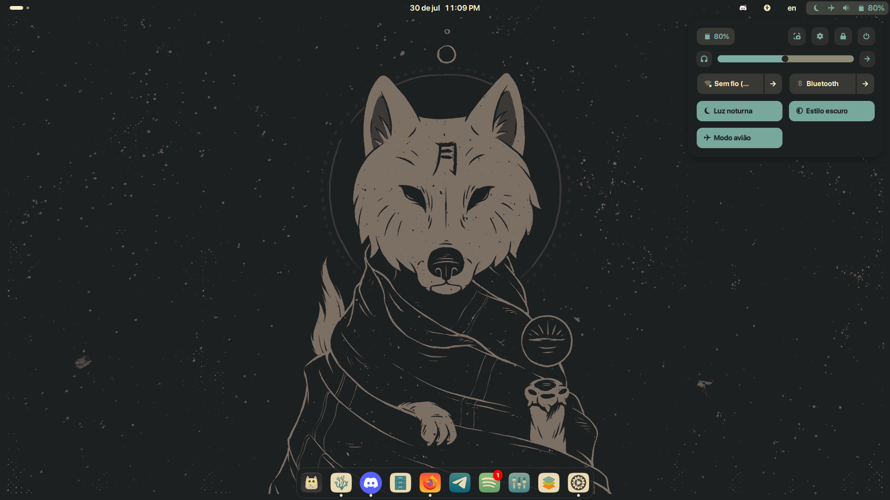
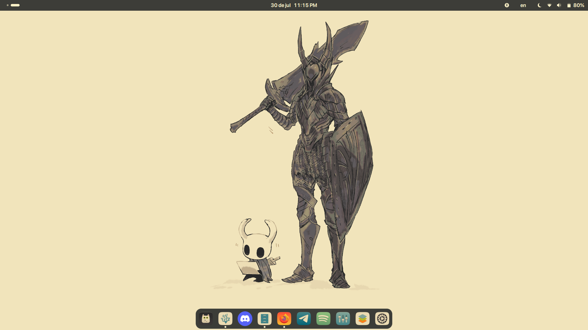
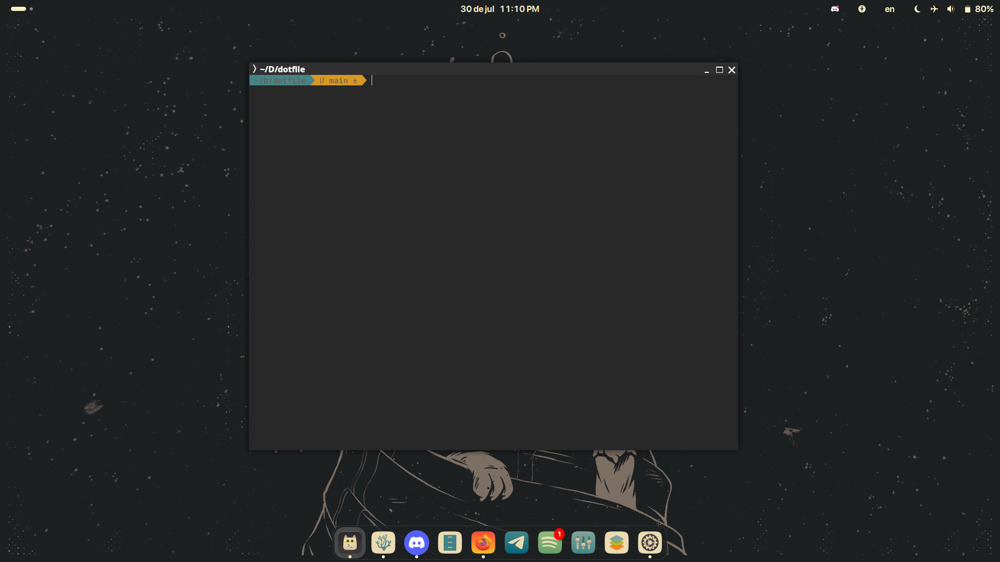
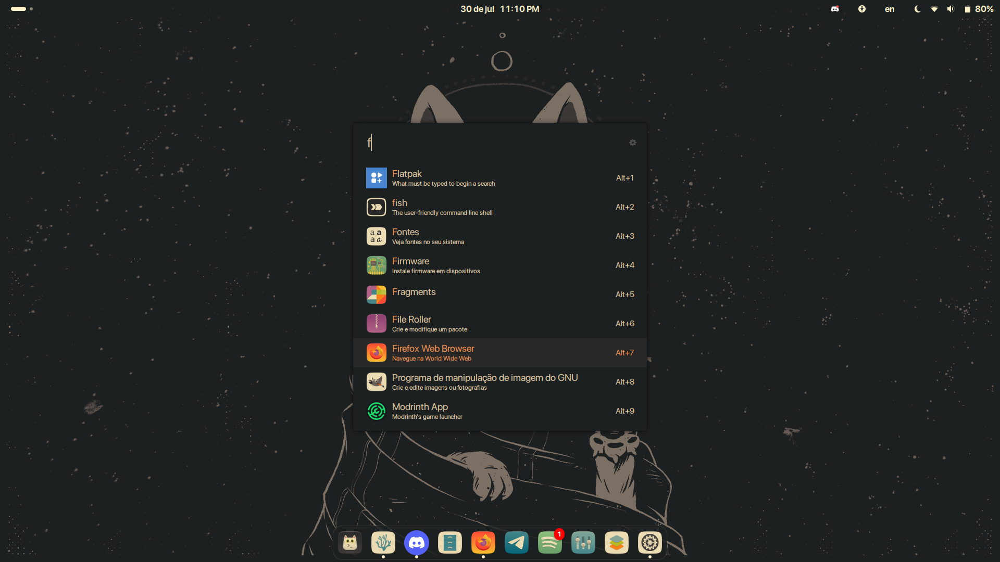

<h1>Dotfile Gnome</h1>
<p>Extensões</p>
 <ul>
            <li><a href="https://extensions.gnome.org/extension/19/user-themes">User Themes</a></li>
            <li><a href="https://extensions.gnome.org/extension/3193/blur-my-shell/">Blur My Shell</a></li>
            <li><a href="https://extensions.gnome.org/extension/307/dash-to-dock/">Dash To Dock</a></li>
            <li><a href="https://extensions.gnome.org/extension/615/appindicator-support/">Appindicatorsupport</a></li>
            <li><a href="https://extensions.gnome.org/extension/4470/media-controls/">Mediacontrols</a></li>
        </ul>


<p>Shell Fish</p>
<a href="https://github.com/oh-my-fish/oh-my-fish">Oh my Fish</a>



<a href="https://ulauncher.io/">Ulauncher</a>
<p>O ULauncher é um lançador de aplicativos rápido e leve para Linux. Ele funciona como um "spotlight" ou "alfred" para distribuições Linux, permitindo que você:

  Pesquise e abra rapidamente aplicativos, arquivos e pastas.

  Execute comandos do sistema diretamente.

  Use extensões em Python para adicionar funcionalidades como traduções, cálculos, busca na web, etc.

  Navegue por um histórico inteligente baseado em uso frequente.

É altamente customizável, tem uma interface simples e funciona bem em ambientes GTK, como GNOME e Xfce. Ideal para quem quer agilidade e produtividade via teclado.</p>


<h2>Instalação do Ulauncher</h2>

Ubuntu
```Ubuntu
sudo add-apt-repository universe -y && sudo add-apt-repository ppa:agornostal/ulauncher -y && sudo apt update && sudo apt install ulauncher
```
Archlinux
```Archlinux
git clone https://aur.archlinux.org/ulauncher.git && cd ulauncher && makepkg -is
```
Fedora
```Fedora
sudo dnf install ulauncher
```
